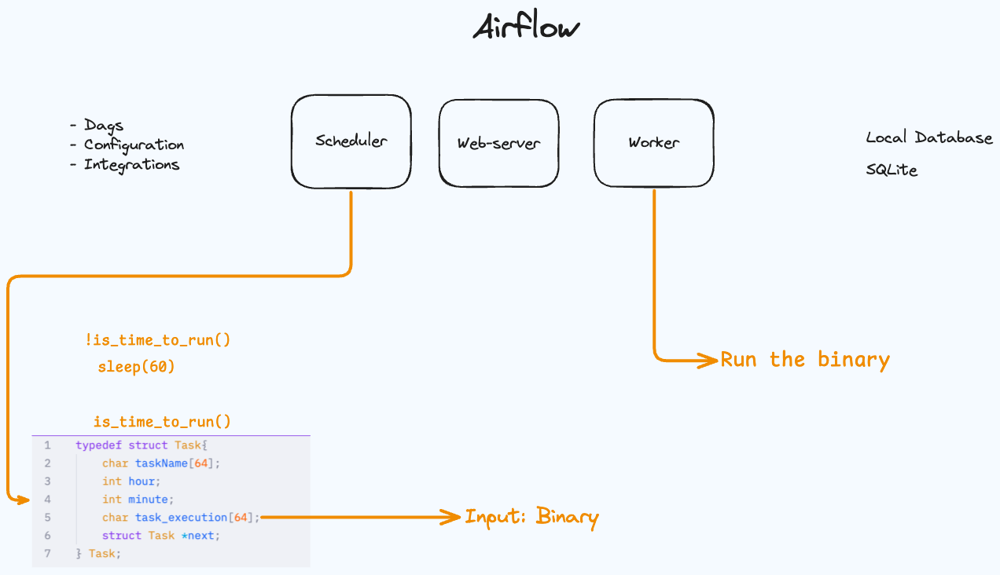

# Conduit

Orchestrator for bash or executions, like mage/airflow/etc..

The idea here is that the Orchestrator run any binary file passed by the scheduler struct.

### Architecture:

### Dags folder
Binary files to send for worker when the scheduler time matches.

### Nix setup

nix build
> Result in ./result/bin/output

nix develop
> Then use make normally
